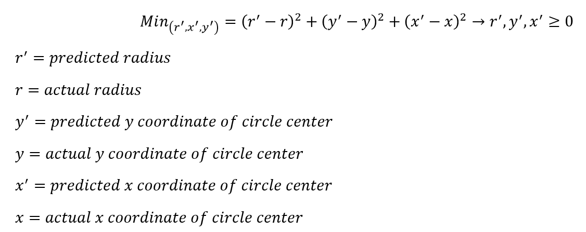
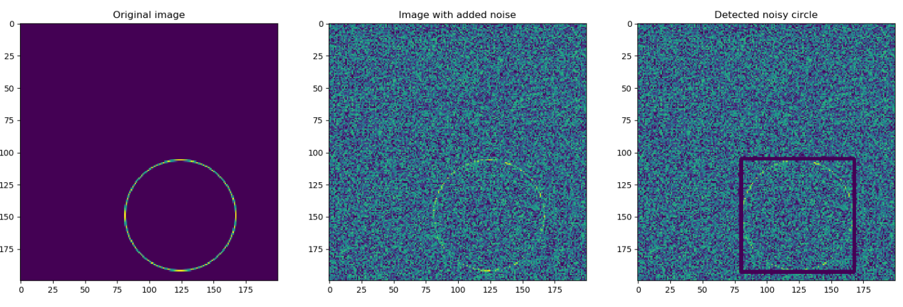

### This folder contains .py files that are used to train a model to predict radius and center coordinates of circle-like shapes in a noisey image.

### Files Description
* main: used to evaluate the trained model on 1000 generated samples with a noise ratio of 2.
* generate_training_data: similar to main, but used to generate the training, validation, and test data used to train the deep learning model.
* predictor: contains the deep learning model and core code that makes the inference using the generated samples in main.
* validation: code snippet used to validate the model while training.
* output.txt: contains log data for the last 1000 training epochs.

### Folders Description
* checkpoints: contains 2 checkpoint files of the trained model.
* tensorboard: contrains an example tensorboard log file for some of the training steps.

### Problem Formulation 
In order to predict the center coordinates and radius of a circle, a deep learning model can be trained to produce three outputs
that are >=0 since the radius and coordinates in image are always positive. To train the model to make such prediction a loss
function needs to be formulated. Since we are measuring the difference between prediction and ground truth, 
this means we are dealing with a regression problem and a typical regression loss function that can be used is L2 loss with slight
modification to include multiple variables to optimize for as shown below.
* Loss = Minimize(radius',xcoord',ycoord') for {(radius' - radius)^2 + (xcoord' - xcoord)^2  + (ycoord' - ycoord)} while (radius',xcoord',ycoord')>=0

### Simplist use [this will make predictions]
* python main.py

